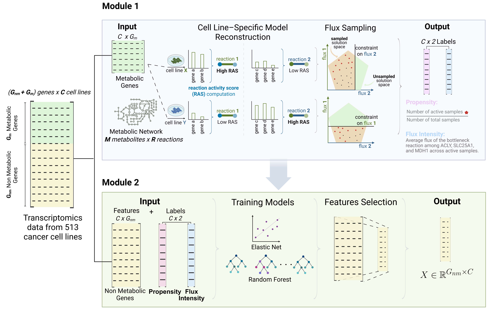

# Mechanistically Informed Machine Learning Links Non-Canonical TCA Cycle Activity to Warburg Metabolism and Hallmarks of Malignancy

This repository contains the code and relevant resources used in the analysis presented in the paper:

**Mechanistically Informed Machine Learning Links Non-Canonical TCA Cycle Activity to Warburg Metabolism and Hallmarks of Malignancy**  
*Lin Lihao, Francesco Lapi, Bruno G. Galuzzi, Marco Vanoni, Lilia Alberghina, Chiara Damiani*  
(Submitted / Preprint available at: [insert DOI or arXiv link])

## Pipeline overview

  

We adopted a two-step computational strategy to dissect non canonical TCA cycle (Arnold Cycle) activity across cancer cell lines.

In the first module, we used constraint-based metabolic modeling to infer the activity of the Arnold Cycle from gene expression data. Specifically, we extracted transcriptomic profiles from 513 cancer cell lines cultured under standardized conditions and reconstructed a cell-specific metabolic model for each line based on the ENGRO2.2 core network. Reaction constraints were individualized by computing Reaction Activity Scores (RAS) using Gene–Protein–Reaction (GPR) rules, and these scores were used to rescale flux boundaries to reflect the transcriptional context of each cell line. To comprehensively explore the space of feasible metabolic states, we performed unbiased flux sampling on each transcriptome-constrained model using a corner-based sampling algorithm. This allowed us to approximate the distribution of steady-state flux configurations consistent with mass balance and expression constraints, without assuming predefined cellular objectives. From these sampled flux distributions, we derived two complementary metrics to quantify Arnold Cycle activity: `Cycle Propensity`, defined as the fraction of flux samples in which the three reactions (*SLC25A1*, *ACLY*, *MDH1*) of the Arnold Cycle are simultaneously active; and `Cycle Flux Intensity`, which captures the average flux through the bottleneck reaction when the cycle is active.

In the second module, these *in silico*–derived metrics were used as training labels for supervised machine learning models. To predict `Cycle Propensity` and `Cycle Flux Intensity` from transcriptional features beyond the metabolic network, we trained regressors using expression data from non-metabolic genes. After model training, we performed feature selection to identify robust predictors of Arnold Cycle activity, thereby uncovering broader transcriptional programs associated with its engagement.

## Data availability

* **Gene expression data** were obtained from the [Cancer Cell Line Encyclopedia (CCLE)](https://sites.broadinstitute.org/ccle/datasets).
* **Gene dependency scores** were retrieved from [DepMap](https://depmap.org/portal/data_page/?tab=allData).
* **Flux metrics** (Cycle Propensity and Cycle Flux Intensity) for each cell line are available as a CSV file in: `Module2_ml/data/info/non_canonical_state.csv`
* Mean flux values across the sampled steady-state distributions are available in:
`Module1_sampling/dati_sampling/dati/sampling/mean`
*  Due to size constraints, full flux sampling data and models are not uploaded to GitHub. If needed, they can be generated locally using thenotebook `Module1_sampling/script/sampling_script.ipynb`.
*  Preprocessed features and labels used for model training are available in:
`Module2_ml/data/X_y/`

## Main notebooks description

| Step | Notebook                                           | Description                                                                                                                                                    |
| ---- | -------------------------------------------------- | -------------------------------------------------------------------------------------------------------------------------------------------------------------- |
| 1️⃣  | `Module1_sampling/script/sampling_script.ipynb`    | Reconstructs **cell-specific metabolic models** from gene expression data and performs **corner-based sampling** (CBS) for each model.                         |
| 2️⃣  | `Module1_sampling/script/comp_nctca_metrics.ipynb` | Computes the two activity metrics from sampled fluxes: `Cycle Propensity` and `Cycle Flux Intensity`.                                                          |
| 3️⃣  | `Module2_ml/scripts/en_rf_selec.ipynb`             | Performs **feature selection** using ElasticNet and Random Forest to identify transcriptional predictors of Arnold Cycle activity.                             |
| 4️⃣  | `Module2_ml/scripts/xgboost_shap.ipynb`            | Trains an **XGBoost model** on the selected features and applies **SHAP analysis** to interpret model predictions and prioritize key transcriptional features. |

