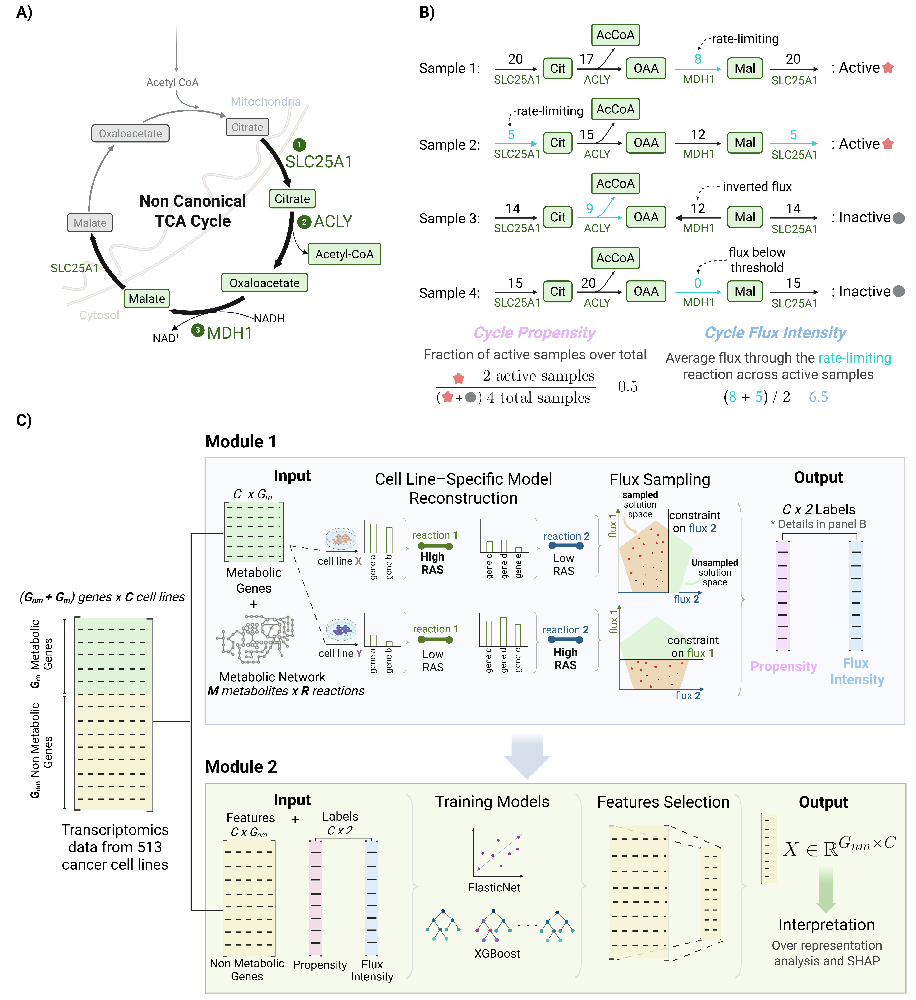

# Mechanistically Informed Machine Learning Links Non-Canonical TCA Cycle Activity to Warburg Metabolism and Hallmarks of Malignancy

This repository contains the code and relevant resources used in the analysis presented in the paper:

**Mechanistically Informed Machine Learning Links Non-Canonical TCA Cycle Activity to Warburg Metabolism and Hallmarks of Malignancy**  
*Lihao Lin, Lapi Francesco, Bruno G. Galuzzi, Marco Vanoni, Lilia Alberghina, Chiara Damiani*  
(Submitted / Preprint available at: [insert DOI or arXiv link])

## Paper abstract

Cancer cells undergo extensive metabolic rewiring to support growth, survival, and phenotypic plasticity. A non-canonical variant of the tricarboxylic acid (TCA) cycle, characterized by mitochondrial-to-cytosolic citrate export, has emerged as critical for embryonic stem cell differentiation. However, its role in cancer remains poorly understood.

Here, we present a two-step computational framework to systematically analyze the activity of this non-canonical TCA cycle across over 500 cancer cell lines and investigate its role in shaping hallmarks of malignancy. First, we applied constraint-based modeling to infer cycle activity, defining two complementary metrics: *Cycle Propensity*, measuring the likelihood of its engagement in each cell line, and *Cycle Flux Intensity*, quantifying average flux through the reaction identified as rate-limiting. We identified distinct tumor-specific patterns of pathway utilization. Notably, cells with high *Cycle Propensity* preferentially rerouted cytosolic citrate via aconitase 1 (ACO1) and isocitrate dehydrogenase 1 (IDH1), promoting α-ketoglutarate (αKG) and NADPH production. Elevated engagement of this cycle strongly correlated with Warburg-like metabolic shifts, including decreased oxygen consumption and increased lactate secretion.

In the second step, to uncover non-metabolic transcriptional signatures associated with non-canonical TCA cycle activity, we performed machine learning–based feature selection using ElasticNet and XGBoost, identifying robust gene signatures predictive of cycle activity. Over-representation analysis revealed enrichment in genes involved in metastatic behavior, angiogenesis, stemness, and key oncogenic signaling. SHapley Additive exPlanations (SHAP) further prioritized genes with the strongest predictive contributions, highlighting candidates for experimental validation. Correlation analysis of DepMap gene-dependency profiles revealed distinct vulnerability patterns associated with non-canonical TCA cycle activity, outlining a characteristic landscape of genetic dependencies.

Together, our integrative framework uniting constraint-based metabolic modeling and machine learning systematically reveals how non-canonical TCA cycle dynamics underpin metabolic plasticity and promote malignant traits.

## Author Summary

Among the many metabolic alterations reported in cancer, one involves a recently discovered non-canonical variant of the TCA cycle that exports citrate from mitochondria to the cytosol. The function of this non-canonical TCA cycle has been related to transitions in cellular identity in stem cells. However, its functional role in tumor metabolism remains poorly understood.

To address this question, we designed a computational framework that integrates mechanistic metabolic modeling and machine learning to examine the activity of this pathway in over 500 cancer cell lines. Using this approach, we quantified the activity of the non-canonical TCA cycle and identified gene-expression programs predictive of its engagement. We found that cells using this pathway tend to consume less oxygen and release more lactate, adopting a Warburg-like metabolism. Gene-expression programs predictive of this metabolic state are enriched in processes linked to metastatic behavior, angiogenesis, stemness, and key oncogenic signaling — core hallmarks of malignancy.

Together, our findings show that this recently identified pathway couples metabolic rewiring with transcriptional programs that promote tumor aggressiveness and progression, indicating a mechanistic link between the engagement of the non-canonical TCA cycle and the transcriptional states associated with malignancy.

## Pipeline overview

  

We conceived a two-step computational strategy integrating a metabolic modeling module and a machine learning module to dissect the activity of the non-canonical TCA cycle (Cit-Mal) across cancer cell lines.

In the **metabolic modeling module**, we employed state-of-the-art constraint-based modeling techniques to infer Cit-Mal Cycle activity directly from gene expression data. Cellular metabolism is represented as a network of biochemical reactions subject to stoichiometric mass balance and physicochemical constraints, such as minimal and maximal reaction fluxes. These flux boundaries can be personalized using omics data—such as transcriptomic profiles—to reflect the molecular context of individual samples.

In this study, we tailored the boundaries of the generic core metabolic network ENGRO2.2 based on the transcriptomes of 513 cancer cell lines cultured under standardized conditions. Specifically, we computed Reaction Activity Scores (RAS) from gene expression using Gene–Protein–Reaction (GPR) rules, and used these scores to modulate the upper bounds of each reaction’s feasible flux. Each reconstructed model defines the space of feasible steady-state flux distributions for a specific cell line.

Rather than selecting a single flux vector by optimizing a predefined biological objective (e.g., biomass yield), we adopted flux sampling to systematically explore the entire solution space consistent with network structure and molecular constraints. We used a corner-based sampling algorithm to generate thousands of feasible flux distributions per model, thereby approximating the distribution of steady-state flux configurations for each cell line.

From these sampled flux distributions, we devised two complementary metrics to quantify Cit-Mal Cycle activity:

- `Cycle Propensity`: the fraction of sampled steady-state flux distributions in which all three hallmark reactions (SLC25A1, ACLY, MDH1) are simultaneously active. This metric is dimensionless (0–1) and reflects the likelihood that the cycle operates under the given constraints.
- `Cycle Flux Intensity`: the average flux through the bottleneck reaction (typically ACLY) in those sampled states where the cycle is active. This metric is expressed in arbitrary flux units (e.g., mmol/gDW/h), reflecting the relative nature of transcriptomics-derived constraints.

In the **machine learning module**, these *in silico*–derived metrics serve as training targets for supervised regression models designed to predict `Cycle Propensity` and `Cycle Flux Intensity` from non-metabolic gene expression data. After model training, we performed feature selection to identify robust transcriptional predictors of Cit-Mal Cycle activity, thereby revealing broader gene-expression programs potentially regulating or co-occurring with its engagement. Finally, we applied SHAP analysis to quantify the contribution of individual genes to model predictions, providing a biologically interpretable link between transcriptional features and Cit-Mal Cycle activity.

## Data availability

* **Gene expression data** were obtained from the [Cancer Cell Line Encyclopedia (CCLE)](https://sites.broadinstitute.org/ccle/datasets).
* * **Validation fluxes**  
  For the validation of our cycle activity metrics, we used fluxes generated in Maspero *et al.* (2024), derived from spatial transcriptomics data from clear cell renal cell carcinoma tissue and adjacent normal parenchyma (sample ID: `PD45816_I2`).  
  Preprint: [https://doi.org/10.1101/2024.11.28.625842](https://doi.org/10.1101/2024.11.28.625842)
* **Gene dependency scores** were retrieved from [DepMap](https://depmap.org/portal/data_page/?tab=allData).
* **Flux metrics** (Cycle Propensity and Cycle Flux Intensity) for each cell line are available as a CSV file in: `Module2_ml/data/info/non_canonical_state.csv`
* Mean flux values across the sampled steady-state distributions are available in:
`Module1_sampling/dati_sampling/dati/sampling/mean`
*  Due to size constraints, full flux sampling data and models are not uploaded to GitHub. If needed, they can be generated locally using thenotebook `Module1_sampling/script/sampling_script.ipynb`.
*  Preprocessed features and labels used for model training are available in:
`Module2_ml/data/X_y/`

## Main notebooks description

| Step | Notebook                                           | Description                                                                                                                                                    |
| ---- | -------------------------------------------------- | -------------------------------------------------------------------------------------------------------------------------------------------------------------- |
| 1️⃣  | `Module1_sampling/script/sampling_script.ipynb`    | Reconstructs **cell-specific metabolic models** from gene expression data and performs **corner-based sampling** (CBS) for each model.                         |
| 2️⃣  | `Module1_sampling/script/comp_nctca_metrics.ipynb` | Computes the two activity metrics from sampled fluxes: `Cycle Propensity` and `Cycle Flux Intensity`.                                                          |
| 3️⃣  | `Module2_ml/scripts/en_rf_selec.ipynb`             | Performs **feature selection** using ElasticNet and Random Forest to identify transcriptional predictors of Arnold Cycle activity.                             |
| 4️⃣  | `Module2_ml/scripts/xgboost_shap.ipynb`            | Trains an **XGBoost model** on the selected features and applies **SHAP analysis** to interpret model predictions and prioritize key transcriptional features. |

